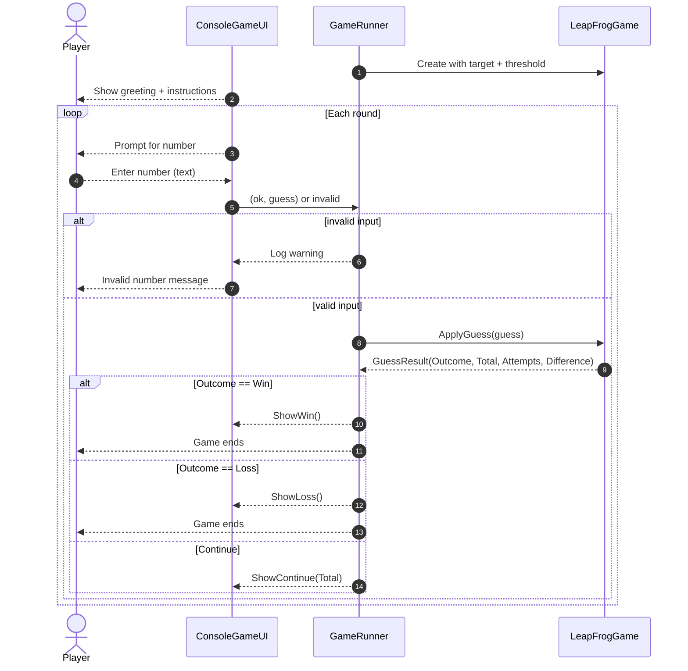
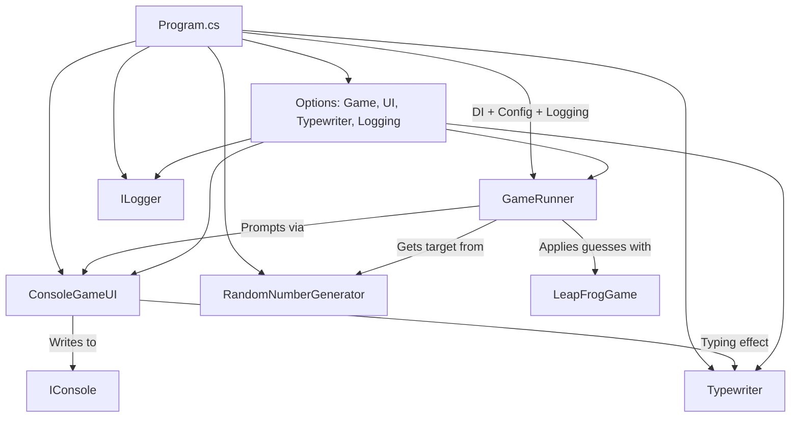
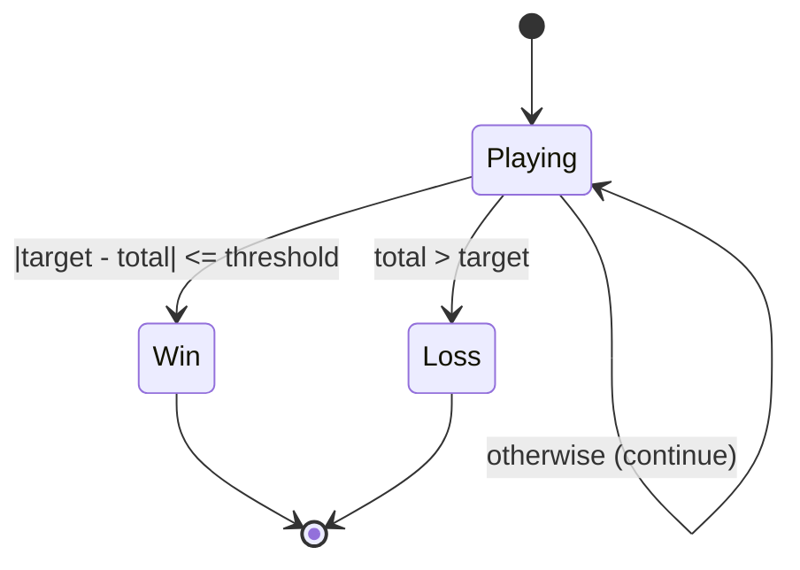
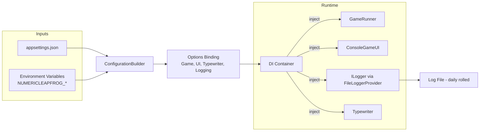

# Numeric Leap Frog

A small, beginner-friendly console game written in modern .NET where you add numbers trying to get close to a secret target without going over. If your total lands within a small “threshold” of the target, you win. If you overshoot, you lose.


## Quick start

Prerequisites
- .NET9 SDK installed (https://dotnet.microsoft.com/download)

Run the game
- Open a terminal in the repository folder.
- Build: `dotnet build`
- Run: `dotnet run --project NumericLeapFrog`

Run tests
- `dotnet test`

That’s it—follow the on-screen instructions in the console.


## How to play (for newcomers)
- The game secretly picks a target number (by default between1 and100).
- You type in any whole number to add to your running total.
- Goal: get your total close enough to the target without going over.
- Win: if your total is within the “threshold” (default5) of the target.
- Lose: if your total goes higher than the target.
- Otherwise, keep guessing—your total carries forward each round.


## What you get out-of-the-box
- Clean architecture with separate UI, domain, and infrastructure layers.
- Dependency Injection, configuration, and logging using the Microsoft.Extensions stack.
- Typewriter-style text output for a playful console experience.
- Unit tests with xUnit.


## Project structure
- `NumericLeapFrog`: the main console app
 - `Program.cs`: wires up DI, configuration, and logging
 - `Domain/BusinessLogic`: game rules (`LeapFrogGame`), runner (`GameRunner`), RNG abstraction
 - `Domain/Models`: result types (`GuessResult`, `GuessOutcome`)
 - `UI`: console UI (`ConsoleGameUI`) and `Typewriter`
 - `Infrastructure`: console abstraction, time delay, randomness, logging to files, options validation
 - `Configuration/Options`: strongly-typed options for Game, UI, Typewriter, and Logging
- `NumericLeapFrog.Tests`: unit tests


## Diagrams (Mermaid)

Game loop sequence (user guess ? game rules ? outcome):


High-level components and flow:


Game outcome state machine:


Configuration and logging data flow:



## Configure the game
Settings live in `NumericLeapFrog/appsettings.json` and can also be overridden with environment variables.

Default `appsettings.json` snippet:
```json
{
 "Game": {
 "TargetMin":1,
 "TargetMax":100,
 "Threshold":5
 },
 "Typewriter": { "DelayMs":20 },
 "UI": { "PauseAtEnd": true },
 "Logging": {
 "Category": "NumericLeapFrog",
 "Directory": null,
 "FileNamePrefix": "game",
 "MinimumLevel": "Information",
 "RollingPeriod": "Daily",
 "TimestampFormat": "yyyy-MM-dd HH:mm:ss",
 "UseUtcForRoll": true
 }
}
```

Environment variables
- Prefix: `NUMERICLEAPFROG_`
- Use double underscores `__` to represent nested sections.

Examples
- Change the target range:
 - `NUMERICLEAPFROG_Game__TargetMin=10`
 - `NUMERICLEAPFROG_Game__TargetMax=250`
- Make the typing effect instant:
 - `NUMERICLEAPFROG_Typewriter__DelayMs=0`
- Disable the final “press Enter to exit” pause:
 - `NUMERICLEAPFROG_UI__PauseAtEnd=false`
- Turn on more logs:
 - `NUMERICLEAPFROG_Logging__MinimumLevel=Debug`
- Write logs to a specific folder:
 - `NUMERICLEAPFROG_Logging__Directory=C:\\Logs\\NumericLeapFrog`


## Logging
- Logs are written via `FileLoggerProvider` to daily-rolled files.
- File name prefix and directory are configurable (see Logging section above).
- Log category is `NumericLeapFrog` by default.


## Extend or customize
- New UI: implement `IGameUI` and register your type in `Program.cs`.
- Different RNG: implement `IRandomNumberGenerator` and swap it in DI.
- Game rules: `LeapFrogGame` holds the core logic—easy to unit test.


## Common issues
- “dotnet not found”: ensure the .NET9 SDK is installed and the `dotnet` command is in your PATH.
- Build errors about target framework: ensure you are on a recent SDK that supports `net9.0`.
- Nothing printed or game ends too fast: check `UI.PauseAtEnd` and `Typewriter.DelayMs` settings.


## Contributing
- Open an issue or PR with a clear description.
- Keep code small, tested, and beginner-friendly.


## License
- See the repository’s `LICENSE` file if present.
